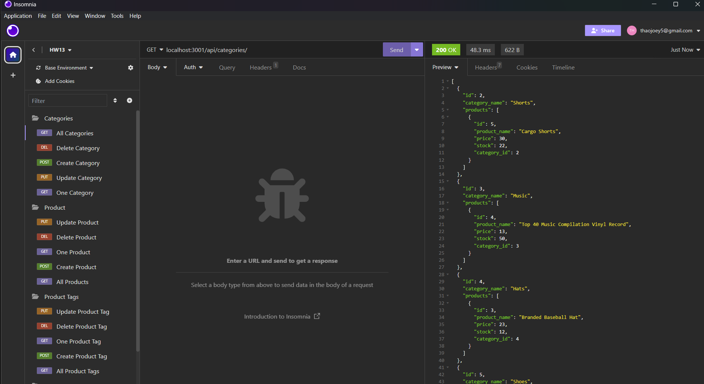

# E-Commerce 
```
Github repo:
https://github.com/Thaodev23/e-commerce

Screencastify video:
https://watch.screencastify.com/v/9HSWY2s0BUILA78OPWYr
```

## User Story

```
AS AN owner of an e-commerce site
I WANT to display my e-commerce product
SO THAT my products will get display optimally on the website
```

## Acceptance Criteria

```
GIVEN I have made a database for my e-commerce site
WHEN I finish adding all the appropriate MySQL info to the database
THEN there will be a connection with the database through Sequelize
WHEN I run the server commands to link up with insomnia
THEN the data can be display in insomnia
WHEN the API routes for POST, PUT, UPDATE and DELETE are tested
THEN the creation, deletion, and updating of data can be completed
```

## Image

Below: Image of the API routes being tested.



## Collaborators

```
Jason Yang:
Github profile - https://github.com/Jasony95
Classmate that collaborated on the homework assignment together.
 ```

```
Sichoun Nplhaib Lee:
Github profile - https://github.com/DDXP3.
Classmate that collaborated on the homework assignment together.
```